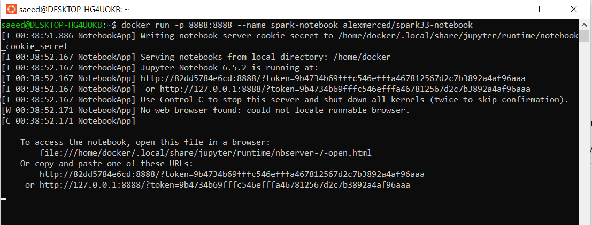
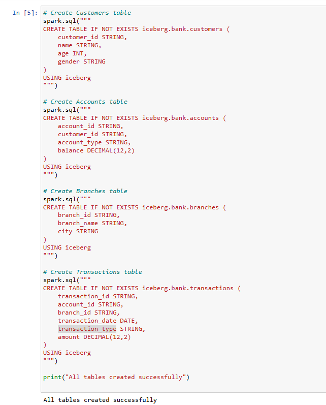
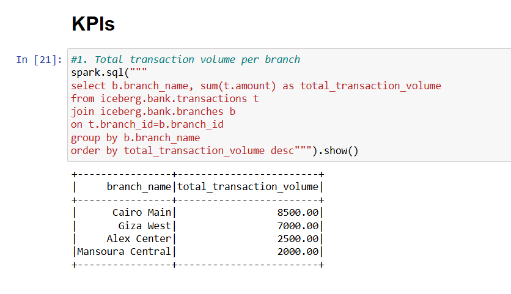
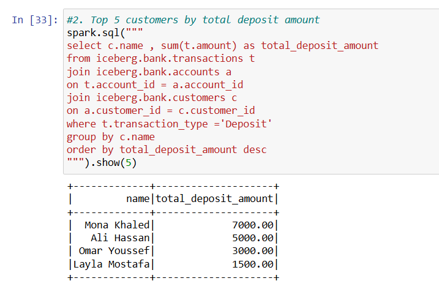
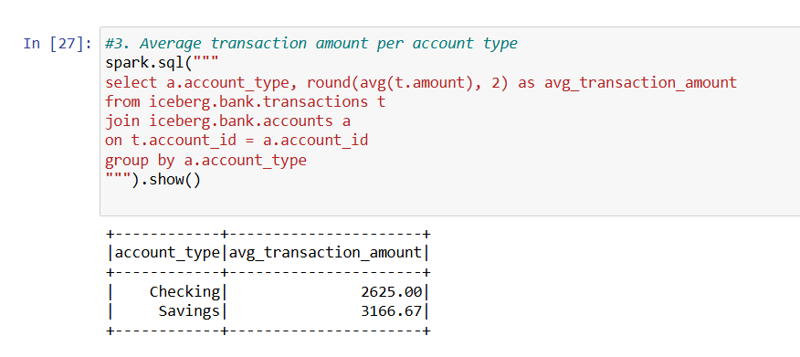
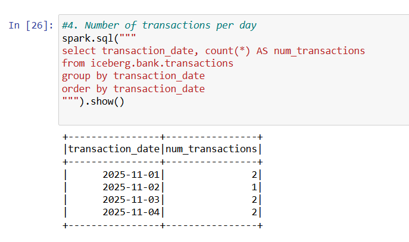
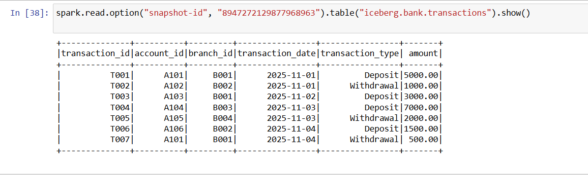

# 🧊 Iceberg Banking Transactions Analytics

##  Overview
This project demonstrates how to use **Apache Iceberg** with **Spark 3.3** to build a simple banking analytics pipeline.  
The goal is to analyze customer accounts, transactions, and branch performance using Iceberg tables.

---

##   Files Included
- **`iceberg_bank_demo.ipynb`** → The full Spark + Iceberg notebook (code implementation).
- **`Iceberg Use Case.pdf`** → Screenshots and step-by-step explanation of the task.

---

##  Environment Setup
Run the Spark notebook container using Docker:

```bash
docker run -p 8888:8888 --name spark-notebook alexmerced/spark33-notebook
Then open the Jupyter Notebook URL shown in the terminal (e.g. http://127.0.0.1:8888/?token=...).

```


    
##  Use Case Description

###  Scenario
A bank wants to track **customers**, **accounts**, **transactions**, and **branches** to generate useful KPIs for business insights.

---

### 📋 Tables Created

| Table | Columns |
|--------|----------|
| **Customers** | `customer_id`, `name`, `age`, `gender` |
| **Accounts** | `account_id`, `customer_id`, `account_type`, `balance` |
| **Branches** | `branch_id`, `branch_name`, `city` |
| **Transactions** | `transaction_id`, `account_id`, `branch_id`, `transaction_date`, `transaction_type`, `amount` |

---



###  KPIs Calculated
- 💰 **Total transaction volume per branch**  

- 🏦 **Top 5 customers by total deposit amount**  

- 📈 **Average transaction amount per account type**

- 📅 **Number of transactions per day**  

- 🕓 **Iceberg snapshots** to view historical transactions.



---

###  Technologies Used
- **Apache Spark 3.3**  
- **Apache Iceberg 1.5.2**  
- **Docker**  
- **Jupyter Notebook** (`alexmerced/spark33-notebook` image)

---

###  Notes
- The Iceberg warehouse is stored locally inside the container under `iceberg_warehouse/`.  
- You can extend this project by connecting it to a **data lake** or **BI dashboard**.

